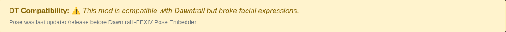

# XIV Archive Pose Image Embedder
[Installation guide below.](#installation-guide)

## HEADSUP!

This plugin is very much a work in progress. I've done the best I can to test but I am also just 1 person and this is a hobby project. I do not give a guarantee things will work but I will do what I can to fix any issues. 

## The plugin!

This browser extension adds a new blue Download button to xivmodarchive.com mod pages which embedds the preview image, author, and tags into the `.pose` file — or into every `.pose` file contained in a downloaded `.zip` archive.


| `.pose` download | `.zip` archive download |
| --- | --- |
|  |  |

This extension also updates the warning label on pose mod pages whose last updated before Dawntrail.


| Before (Top image) & After (Bottom image)              |
|--------------------------------------------------------|
|  | 
|   |


## What it does

FFXIV pose mods are JSON files. By default they don't carry a preview image. Some might contain author, or tags but most don't — You can quickly lose track of what the pose actually does compared to the preview on XIV mod page. 

This extension fixes that: with one click it grabs the page's preview image, author, and tags and stamps them directly into the pose file(s) as you download what you want. The file "remembers" where it came from, no matter where it ends up.

The exact same flow works for ZIP archives that contain multiple poses, so collection-style mods are handled in a single click instead of one pose at a time.

## Features

- **Your poses remember where they came from.** Without the extension, a downloaded `.pose` file is just bone data — no preview image, no author, no description. After installing the extension, every pose you download is automatically stamped with:
  - the **preview image** shown on the mod page,
  - the **author's name**,
  - the **tags** listed on the page,
  - the page's **description**, with a **link back to the mod page** at the end,  Even years
  - the **last update date** of the pose.

  Months later you'll still know which mod page each pose came from, what the author wrote about it, and what it's supposed to look like.

- **One extra download button over the normal download.** A blue button appears right above the site's regular "Download Mod" link. The site's original download still works exactly as before — the extension just adds a richer version above it. The label adapts to what the page offers: **Download Pose w/ Image** for a single pose, **Download Poses / ZIP w/ Image** for a ZIP archive.

- **Handles ZIP archives in one click.** Many pose mods ship as a ZIP containing several poses. The extension opens the ZIP, updates every pose inside, and re-packages it for you under the original filename. Everything else in the ZIP — textures, READMEs, screenshots, anything else the author included — is left completely untouched. Only `.pose` files are modified.

- **Finds the real archive when the main download is an external link.** Some mod authors point their "Download Mod" button at an external site (Twitter/X, Patreon, etc.) and put the actual `.zip` quietly in the "Other Files and Links" section instead. The extension scans that list and uses the first usable archive it finds, so the blue button works on those pages just like any other.

- **Edge case fix: Fixes pose files uploaded by the creator which has a missing `.pose` extension.** Occasionally a mod author packages a pose file inside a ZIP without the `.pose` ending on the filename. The extension recognizes pose files by looking at their contents, adds the `.pose` for you, and updates them the same way as everything else, so your posing tool (Anamnesis, Ktisis, etc.) will see them correctly.

- **Warns you about old "Dawntrail-compatible" poses.** Plenty of older poses are still tagged as Dawntrail-compatible on the site but were never updated for poses after the patch broke facial expressions. On any pose page with the last update **before Dawntrail's release date (2024-07-02)** will be updated by the extension which turns the green "✅ compatible" badge into a "⚠️" so you know to expect issues before you download.

- **Never overwrites pose information the author already filled in.** If a pose file already has an author name, description, tags, version, or preview image set by hand, the extension leaves those exactly as the author wrote them. It only fills in the fields that are empty or missing.

- **Cleans up preview images automatically.** Black bars on the sides or top/bottom of a screenshot are cropped off, and images are scaled to 720p so the resulting pose file doesn't end filling up your computer storage. GIFs are passed through unchanged but any animations will only display the first frame unless Brio adds support for this (Which I doubt they will).

- **All processed on your machine.** Every step happens locally inside your browser tab. No files are uploaded anywhere or handled by some server, no telemetry is sent, and there are no third-party servers involved.

- **Safety precautions against malicious ZIP archives has been implemented.** Files downloaded from the internet can sometimes contain traps — for example "ZIP bombs" that look tiny but expand to many gigabytes when opened, or archives with filenames designed to escape into your system folders. The extension checks every archive against a set of size and structure limits before touching it. If anything looks wrong it stops and shows an error rather than silently proceeding. The exact thresholds are listed in the [Security](#security) section below.

- **Works on Chromium & Firefox based browser.** (More testing is needed for Firefox but I've done the best I can since I use Vivaldi.)

## Screenshots

### Download button

The button label adapts to whichever file type the mod page links to — there's no "/ ZIP" promise on a page that only serves a single `.pose` file.

### Dawntrail compatibility re-labelling

When a Pose page still shows the green "✅ compatible with Dawntrail" badge but its **Last Version Update** date is older than the Dawntrail launch (2024-07-02), the badge is swapped for a yellow warning so users aren't misled about facial-expression breakage.

# Installation guide

## 🛠️ Chrome / Chromium-based
1. Open Chrome and go to `chrome://extensions/`
2. Turn on **Developer mode** (top right corner).
3. Click **Load unpacked**.
4. Select the `webapp/` folder in this repository.
   - *Note:* Alternatively, you can use `webapp_chrome.zip` if you want to keep the extension as a single archive, but you must still load it via "Load unpacked" after unzipping it or drag-and-drop.

## 🦊 Firefox
1. Open Firefox and go to `about:debugging#/runtime/this-firefox`
2. Click **Load Temporary Add-on...**
3. Select any file inside the `webapp/` folder (e.g., `manifest.json`).
   - *Note:* Temporary add-ons are removed when Firefox restarts. To install permanently, you would need to use a signed XPI or a developer/ESR version of Firefox that allows unsigned extensions.

## For Floorp or maybe other Firefox alternatives ?
1. Open Firefox and go to `about:addons`
2. Click the ⚙️ icon and **Install addon from file**
3. Select `webapp_firefox.zip` file provided in this post or compile one yourself using build.py.

## 📦 Using the Pre-built ZIP Files
The repository includes pre-built ZIP files for each browser:
- `webapp_chrome.zip`: Configured with a `service_worker` (required for Chrome MV3).
- `webapp_firefox.zip`: Configured with `background.scripts` (best compatibility for Firefox/Floorp).

### How to rebuild the ZIP files:
If you modify the source code in the `webapp/` folder, run the build script to update the ZIP packages:
```bash
python build.py
```
This script automatically transforms the base `manifest.json` for Firefox compatibility.

## ZIP Archive Support

In addition to standalone `.pose` files, the extension also supports `.zip` archives whose download links are exposed by xivmodarchive.com.

When the mod's download is a `.zip` archive:

- The archive is opened **entirely in memory**.
- Every `.pose` file inside is located and modified to embed the mod preview image, author, and tags.
- All other files in the archive (textures, materials, READMEs, nested folders, etc.) are left **completely untouched**.
- Nested `.zip` files are **not** recursed into — they pass through unchanged.
- The archive is rebuilt and offered as a download under the **original filename**.

If an individual `.pose` entry cannot be parsed as JSON, it is simply skipped — the rest of the archive is still processed.

## Security

ZIP archives are treated as **untrusted input**. The following protections are enforced before any extraction or modification takes place:

- **ZIP bomb protection** — archives whose compression ratio (`totalUncompressed / compressedArchive`) exceeds **100:1** are rejected.
- **Compression ratio limits** — see above.
- **Maximum archive size** — `.zip` files larger than **100 MB** (compressed) are rejected.
- **Maximum uncompressed size** — archives whose total uncompressed size exceeds **1 GB** are rejected.
- **Maximum file count** — archives containing more than **10,000 entries** are rejected.
- **Maximum pose count** — archives containing more than **1,000** `.pose` files are rejected.
- **Maximum pose size** — any individual `.pose` file larger than **10 MB** (uncompressed) is skipped.
- **Maximum image size** — preview images larger than **2 MB** are rejected.
- **Path traversal protection** — entries containing `..`, absolute paths (`/etc/passwd`), or Windows drive paths (`C:\…`) are skipped.
- **Executable rejection** — archives containing a `.exe` or `.msi` entry are rejected outright. Pose mods have no legitimate reason to ship Windows installers or binaries, so the user is shown an explanatory error and the archive is never modified or downloaded.
- **Invalid JSON handling** — a `.pose` file that fails to parse is skipped rather than aborting the whole archive; no uncaught exceptions are produced.

All processing occurs **locally in the browser**. No files are uploaded anywhere.

Despite these protections, **caution is advised when processing files obtained from untrusted sources**.
